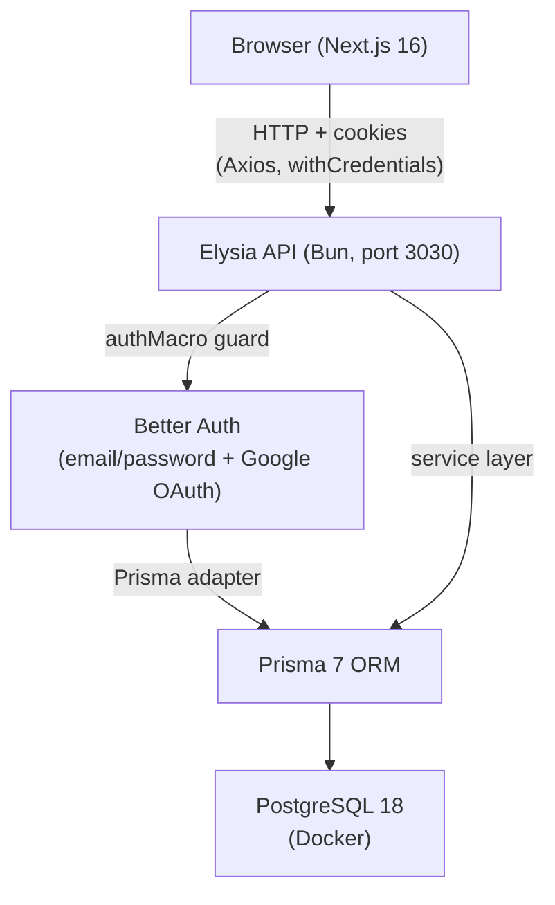

<!-- generated-by: gsd-doc-writer -->
# Architecture

## System Overview

Kashin is a personal expense and income tracker built as a full-stack TypeScript monorepo with a clear client-server separation. The backend is a Bun + Elysia REST API that owns all business logic, database access, and authentication. The frontend is a Next.js 16 App Router application that renders the UI, manages form state, and communicates with the backend exclusively over HTTP. A PostgreSQL 18 database (containerized via Docker Compose) stores all persistent data. The schema is designed to accommodate future AI-powered email receipt extraction without requiring destructive migrations.

## Component Diagram



## Data Flow

A typical authenticated request moves through the system as follows:

1. The browser sends an HTTP request to `http://localhost:3030/api` with a session cookie attached (Axios `withCredentials: true`).
2. The Elysia route is decorated with `{ auth: true }`, which triggers `authMacro` in `src/macros/auth.macro.ts`. The macro validates the session via Better Auth and injects `user` and `session` into the handler context. If no valid session exists, it returns `401`.
3. The controller handler (e.g., `categoryController` in `src/modules/category/index.ts`) extracts `{ user, body, query, params }` from context and delegates directly to the service layer with `userId` as the first argument.
4. The service (e.g., `CategoryService` in `src/modules/category/service.ts`) executes the Prisma query, always scoped by `userId`. It throws `NotFoundError` (404) or `Conflict` (409) on known error conditions.
5. Elysia serializes the service return value as JSON and sends it back. Non-200 responses use `status(201, data)`.
6. On the frontend, TanStack Query caches the response. Mutations trigger `toast.success()` or `toast.error()` via Sonner on completion.

## Key Abstractions

| Abstraction | Location | Description |
|---|---|---|
| `Elysia` app entry | `backend/src/index.ts` | Mounts CORS, auth routes, and all module controllers under `/api` |
| `authMacro` | `backend/src/macros/auth.macro.ts` | Elysia macro that guards routes; injects `user`/`session` via `{ auth: true }` |
| `CategoryService` | `backend/src/modules/category/service.ts` | Abstract class with static methods for category CRUD; pattern for all modules |
| `TransactionService` | `backend/src/modules/transaction/service.ts` | Abstract class for transaction CRUD; scoped by `userId` |
| `prisma` client | `backend/src/lib/prisma.ts` | Singleton Prisma 7 client configured with `@prisma/adapter-pg` |
| `api` (Axios) | `frontend/src/lib/api.ts` | Axios instance pointing to `NEXT_PUBLIC_API_URL` with `withCredentials: true` |
| `authClient` | `frontend/src/lib/auth-client.ts` | Better Auth React client; exposes `useSession()`, `signIn()`, `signUp()` |
| Feature module | `frontend/src/features/<name>/` | Colocation unit: components, hooks, validations, api query options, types |
| `queryOptions` | `frontend/src/features/<name>/api/*.query.ts` | TanStack Query options factories; no per-query staleTime/gcTime (set globally) |

## Directory Structure Rationale

```
kashin/
├── backend/                  — Bun + Elysia API server
│   ├── prisma/
│   │   └── schema.prisma     — Single source of truth for all models and enums
│   └── src/
│       ├── index.ts          — App entry: CORS config, module mounts, server listen
│       ├── lib/              — Singleton infrastructure (prisma client, auth config)
│       ├── macros/           — Elysia macros (auth guard)
│       ├── global/           — Shared error classes (Conflict 409)
│       ├── modules/          — One directory per domain (auth, category, transaction)
│       │   └── <name>/
│       │       ├── index.ts  — Controller: route definitions, validation bindings
│       │       ├── service.ts — Business logic: static methods, Prisma queries
│       │       └── query.ts  — Typebox schemas for query string parameters
│       └── generated/
│           ├── prisma/       — Auto-generated Prisma client (DO NOT EDIT)
│           └── prismabox/    — Auto-generated Elysia body validation schemas (DO NOT EDIT)
│
├── frontend/                 — Next.js 16 App Router application
│   └── src/
│       ├── app/              — Next.js pages and layouts (auth/*, dashboard/*)
│       ├── features/         — Domain feature modules (auth, category, transaction, settings)
│       ├── components/       — Shared UI (30+ shadcn/ui primitives, sidebar, data-table)
│       ├── lib/              — Configured singletons (api, auth-client, utils/cn)
│       ├── hooks/            — App-wide React hooks
│       ├── providers/        — React context providers (QueryClient, theme)
│       └── types/            — Shared TypeScript types
│
└── docker/
    └── postgres/             — Docker Compose for PostgreSQL 18 with persistent volume
```

## Data Model

The Prisma schema uses two ID strategies:

- **UUID v7** (`@default(uuid(7)) @db.Uuid`) — all user-facing tables: `User`, `Session`, `Account`, `Verification`, `Category`, `Transaction`, `EmailInbox`, `AiExtraction`, `RecurringTransaction`.
- **BigInt auto-increment** — internal tables with high insert volume: `EmailLog`, `Attachment`.

Key relationships and design decisions:

- `Transaction` carries `source` (`manual | email | recurring`) and an optional `aiExtractionId` link so AI-parsed receipts can be promoted to confirmed transactions without a schema migration.
- `EmailInbox` → `EmailLog` → `AiExtraction` → `Transaction` is the planned pipeline for v2 email receipt extraction.
- All app tables have a `userId` foreign key with `onDelete: Cascade`, enforcing strict per-user data isolation at the database level.

## Validation Strategy

| Layer | Tool | Generated from |
|---|---|---|
| HTTP request bodies (backend) | prismabox (Typebox) | `prisma/schema.prisma` via `prismabox` generator |
| HTTP query params (backend) | Elysia `t` (Typebox) | Hand-authored in `modules/<name>/query.ts` |
| Form inputs (frontend) | Zod v4 | Hand-authored in `features/<name>/validations/` |

The backend never imports Zod; the frontend never imports Typebox. Prisma is the canonical type source for the backend — `prismabox` auto-generates Elysia-compatible validation schemas directly from the Prisma models.
